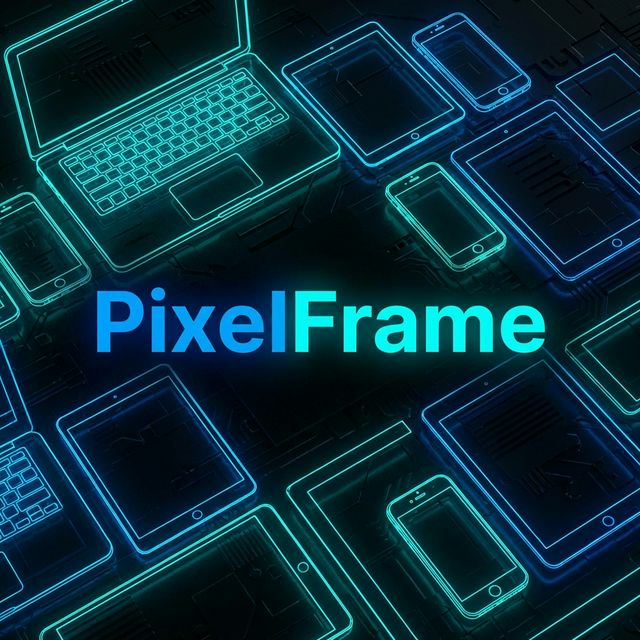

<div align="center">
  

  # PixelFrame

  **The Professional Visual Regression & Responsive Testing Engine.**

  [](https://www.python.org/downloads/)
  [](https://playwright.dev/python/)
  [](LICENSE)
  [](https://github.com/nijil71/PixelFrame/actions/workflows/pixelframe.yml)

  <p align="center">
    <a href="#🚀-key-features">Features</a> •
    <a href="#📦-installation">Installation</a> •
    <a href="#🛠-usage">Usage</a> •
    <a href="#🤖-ci-gating">CI Integration</a> •
    <a href="#🤝-contributing">Contributing</a>
  </p>
</div>

---

## 📸 Overview

PixelFrame is a high-performance CLI tool designed for frontend teams to automate responsive screenshot capture, generate beautiful reports, and perform visual regression testing with ease. It bridges the gap between manual screenshotting and complex, expensive visual testing SaaS.

### 🎥 Demo Showcase
*(Placeholder for Demo GIF - Showcase the ASCII Banner and the summary table)*

---

## 🚀 Key Features

*   📸 **Multi-Breakpoint Capture**: Capture high-fidelity screenshots across mobile, tablet, and desktop viewports in a single run.
*   📱 **Smart Emulation**: Built-in library of **15+ device presets** including iPhone 15, Galaxy S23, and MacBook Pro, handling scale factors and touch support.
*   📂 **Scale with YAML**: Manage complex testing suites using clean `demo-config.yml` files.
*   🌓 **Pixel-Perfect Diffing**: Automatic regression detection with red-highlighted difference heatmaps and similarity scoring.
*   📑 **Zero-Asset Reports**: Generates self-contained HTML reports with embedded Base64 images for total portability.
*   🤖 **CI Gating**: Designed for automation with `--fail-under` thresholds and JSON output for pipeline orchestration.

---

## 📦 Installation

### 1. Prerequisites
Ensure you have **Python 3.10+** installed.

### 2. Quick Setup
```bash
# Clone the repository
git clone https://github.com/nijil71/PixelFrame.git
cd PixelFrame

# Setup virtual environment
python -m venv venv
source venv/bin/activate  # Windows: venv\Scripts\activate

# Install package and dependencies
pip install -e .
playwright install chromium --with-deps
```

---

## 🛠 Usage

### 🚀 Basic Capture
Capture a website using the default responsive breakpoints (Mobile, Tablet, Laptop, Desktop).
```bash
pixelframe capture run https://example.com
```

### 📱 Emulating Specific Devices
Use the built-in device library for accurate real-world testing.
```bash
pixelframe capture run https://apple.com --devices "iPhone 15, iPad Air, MacBook Pro 14"
```

### 📂 Using YAML Configurations
For professional workflows, define your targets in a YAML file.
```bash
pixelframe capture run --config demo-config.yml
```

### 🌓 Visual Regression (Diffing)
Compare two runs to find visual regressions. The CLI will return code `1` if similarity falls below your threshold.
```bash
pixelframe diff run path/to/baseline path/to/current --fail-under 98.0 --open-report
```

---

## 🤖 CI Gating

PixelFrame is designed to live in your CI/CD pipeline. Use it to block PRs that introduce visual regressions.

### GitHub Actions Example
```yaml
- name: Visual Threshold Check
  run: |
    pixelframe diff run ./baseline ./current --fail-under 99.0 --json
```

---

## 📋 Device Library
Run `pixelframe devices list` for the full directory. Some popular presets:

| Category | Devices |
| :--- | :--- |
| **Phones** | iPhone 15 (Pro Max), Galaxy S23, Pixel 8, Galaxy Z Fold 5 |
| **Tablets** | iPad Air, iPad Pro (11"/12.9"), Galaxy Tab S9 |
| **Laptops** | MacBook Air, MacBook Pro (14"/16"), Surface Pro 9 |
| **Desktops**| 1080p, 1440p, 4K |

---

## 🤝 Contributing

We love contributions! Whether it's a new device preset, a bug fix, or a feature request.

1.  **Fork** the Project
2.  **Create** your Feature Branch (`git checkout -b feature/AmazingFeature`)
3.  **Commit** your Changes (`git commit -m 'Add some AmazingFeature'`)
4.  **Push** to the Branch (`git push origin feature/AmazingFeature`)
5.  **Open** a Pull Request

---

<div align="center">
  <p>Built with ❤️ by the PixelFrame Team</p>
  <p>Distributed under the MIT License. See <a href="LICENSE">LICENSE</a> for more information.</p>
</div>
